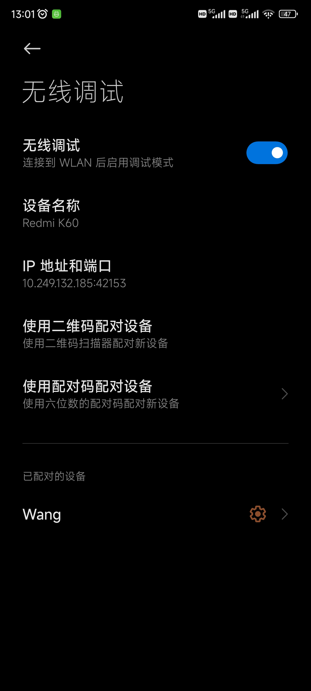
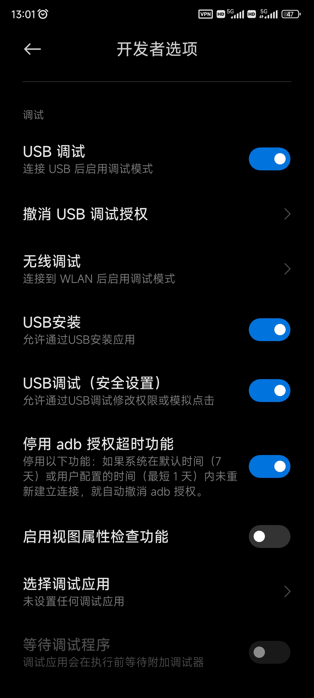
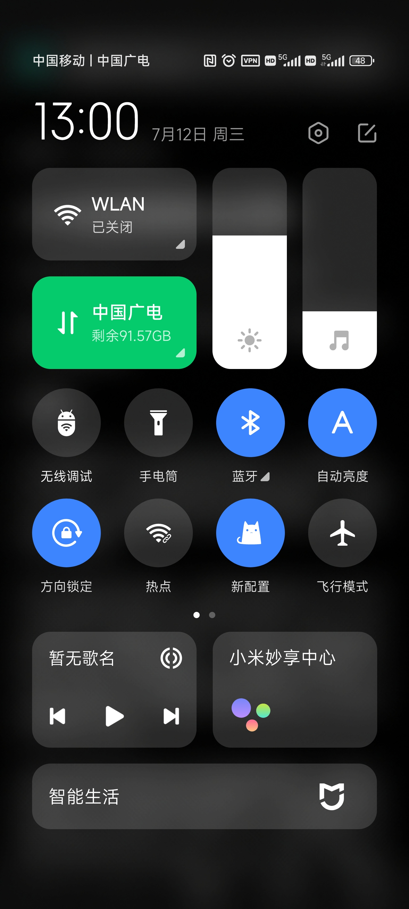
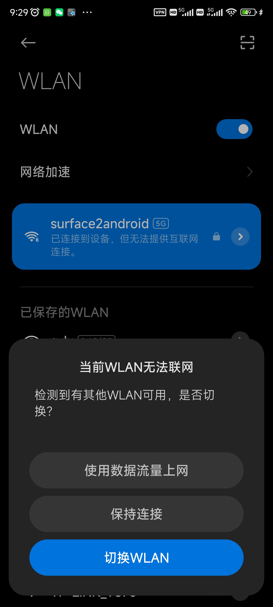
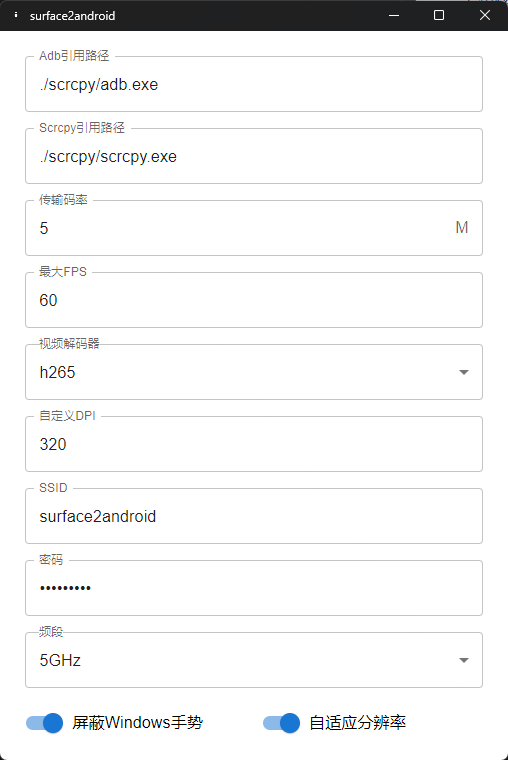

# Surface2Android

Surface2Android 是一个可以让你在 Windows 11 平板电脑上方便地使用手机提供的 Android 系统，支持无线或有线连接的实用工具。
该工具使用了 scrcpy 项目提供的预编译二进制文件，该项目采用 APACHE 2.0 许可证。

## 使用说明

软件初次使用时需要配对你的电脑和安卓设备，请参照如下步骤进行配对。

### 无线连接

1. 确保你的手机和 Windows 11 平板电脑连接到同一个 Wi-Fi 网络（你也可以使用软件内置的 Wi-Fi 热点功能）。
2. 在 Windows 11 平板电脑的系统托盘图标上右键单击，选择 "配对设备"。
3. 在手机的开发者选项中启用无线 ADB 调试，并通过扫描二维码来配对设备。

### 有线连接

1. 打开软件，使用数据线将手机连接到 Windows 11 平板电脑。
2. 在手机的开发者选项中启用 ADB 调试。
3. 授权手机上的 ADB 调试请求。

在配对成功后，你的Windows平板将会自动与连接到同一个无线网络，或者通过数据线连接的已配对手机相连。此时，软件的托盘图标会自动变为Android图标，你只需要点击它即可快速切换到Android模式。

|  |  |  |
| --- | --- | --- |
|  |  |  |

## 注意事项

- 确保你的手机和 Windows 11 平板电脑的操作系统版本兼容，软件在 HUAWEI Matepad E 2022 (Windows11) + Redmi K60 (Android13,MIUI14) 环境下测试通过。
- 对于无线连接，请确保 Wi-Fi 信号稳定，并在开发者选项中启用无线 ADB 调试。
- 对于有线连接，请确保数据线正常工作，并在开发者选项中启用 ADB 调试。
- 你可以通过三指上滑后关闭窗口来退出 Android 模式。
- 对于部分散热能力不足的平板电脑，在使用过程中可能会出现卡顿，可以使用[ThrottleStop](https://www.techpowerup.com/download/techpowerup-throttlestop/)协助解决，但该软件可能对你的设备造成损害，使用前请仔细阅读由ThrottleStop提供的用户须知。
- 软件提供的Wifi热点仅供在外出无Wifi时使用，在MIUI系统中你可以在连接后点击**使用数据流量上网**以在使用平板模式时继续使用因特网。

## 贡献

欢迎为 Surface2Android 项目做出贡献！如果你想要添加新功能、修复错误或改进文档，请提交一个详细说明你的更改的拉取请求。

## 许可证

该项目基于 MIT 许可证。更多详情请参阅 [LICENSE](LICENSE) 文件。

## 作者

Surface2Android 由 [Silent-Reader-CN](https://github.com/silent-reader-cn/Surface2Android) 开发和维护。

特别感谢所有为该项目做出贡献的人。

此 README 模板受到 [Awesome README Templates](https://github.com/matiassingers/awesome-readme) 的启发。
